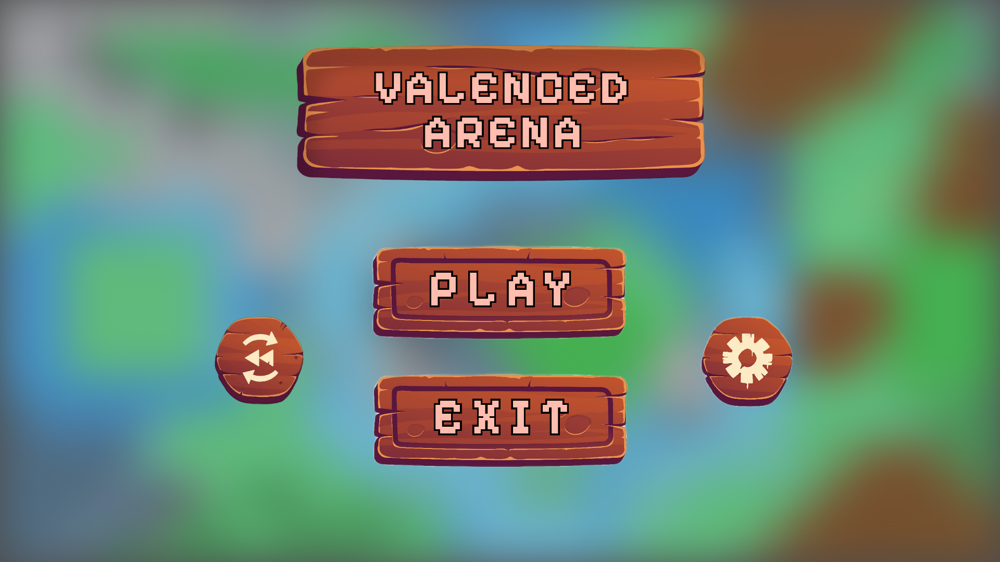
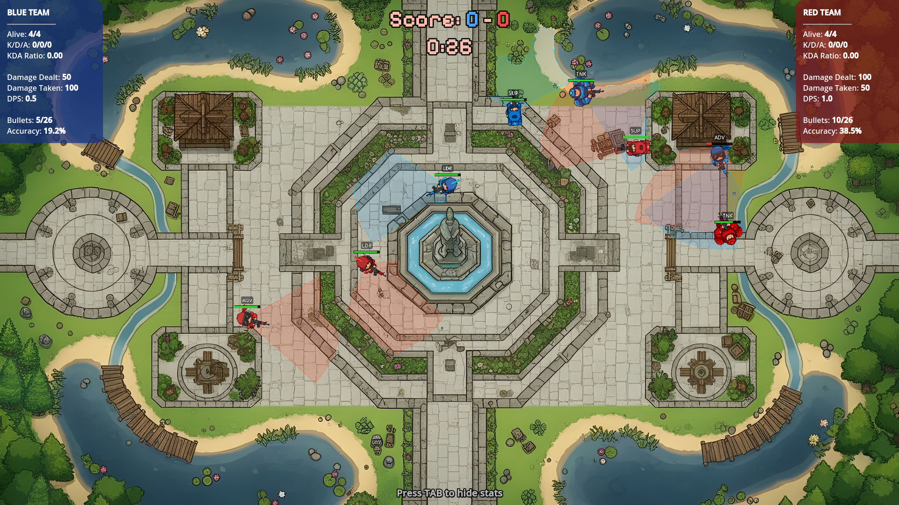
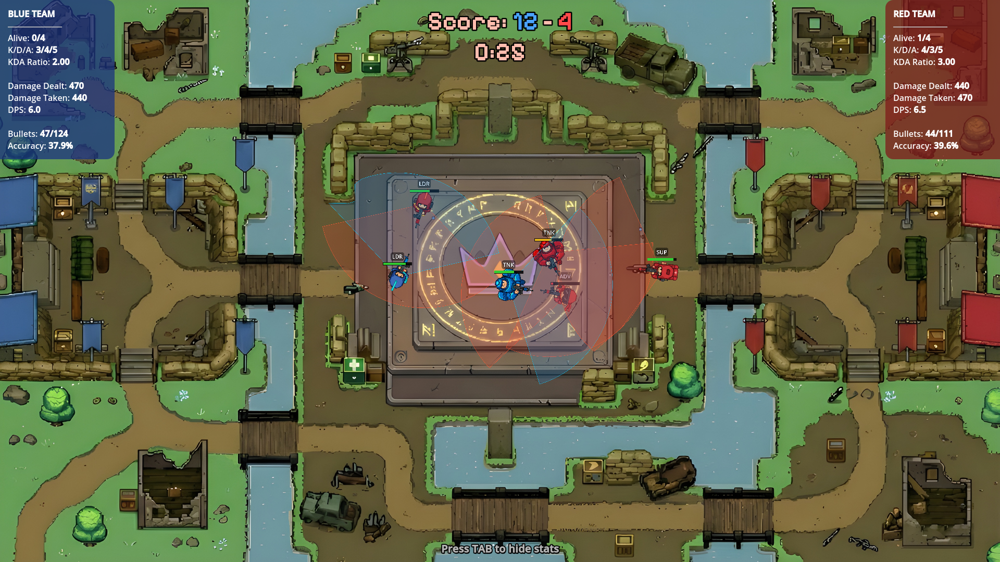
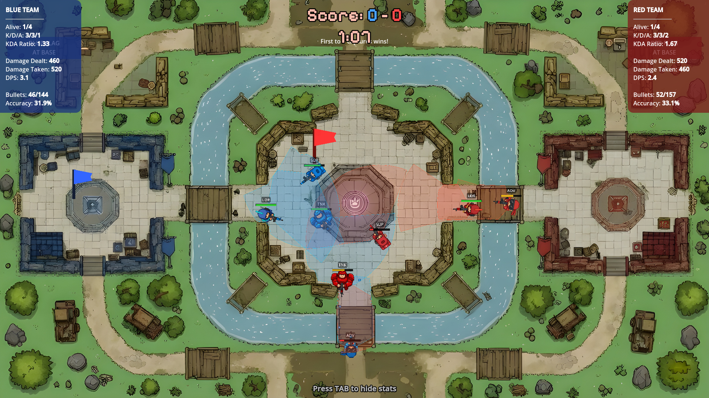
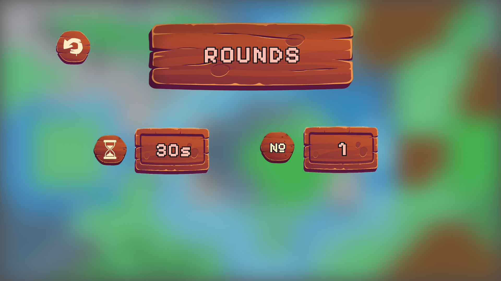
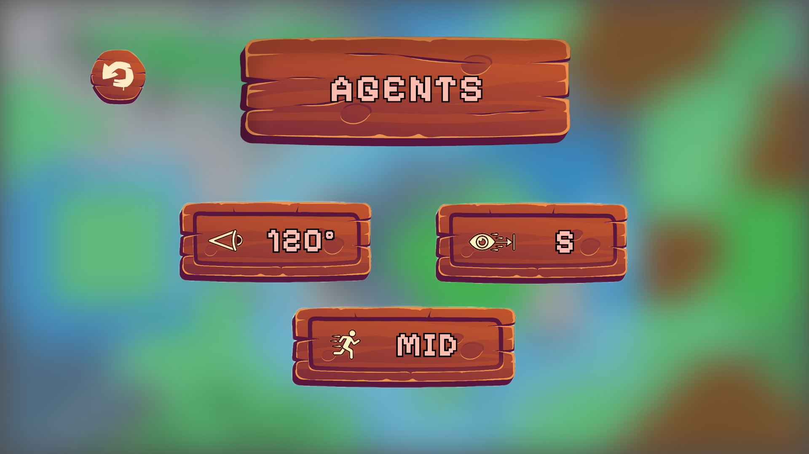
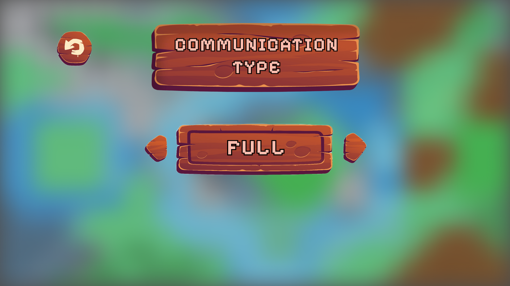

# Valenced Arena

>A 2D top-down micro-battle game with AI-controlled agents. Teams of agents fight across multiple game modes using different AI strategies and communication patterns. The system also collects detailed statistics and supports replaying matches.



## Table of Contents

- [Project Overview](#project-overview)
- [Features](#features)
- [Game Design](#game-design)
  - [Game Modes](#game-modes)
  - [Agent Roles & AI](#agent-roles--ai)
  - [Game Settings](#game-settings)
  - [Message Types](#message-types)
  - [Replay System](#replay-system)
- [Tech Stack](#tech-stack)
- [Running the Project](#running-the-project)

## Project Overview

This project implements a 2D top-down arena shooter where **AI agents** fight in short rounds on predefined maps.
The focus is on:

- implementing several **game modes** (Survival, KOTH, CTF, Transport),
- designing **different AI behaviors per role**,
- experimenting with **communication constraints between agents**,
- and **collecting statistics** over multiple matches.

## Features

- **Top-down 2D arena**
  - Simple shapes (circles/rectangles) for agents, bullets, walls.
  - Line of Sight (LoS) based shooting.

- **Multiple game modes**
  - Survival
  - King of the Hill (KOTH)
  - Capture the Flag (CTF)
  - Transport

- **AI agents with roles**
  - Leader
  - Advance
  - Tank
  - Support  
  Each role uses a different AI paradigm

- **Agent communication**
  - No communication / limited / full communication.
  - Topological, distance-based, time-based communication modes.
  - Messages include MOVE, ASSIST, FOCUS, STATUS, ROLE, etc.

- **Statistics & replay**
  - KDA, DPS/DTPS, round time, distance travelled.
  - Per-mode metrics (Survival, KOTH, CTF, Transport).
  - Match logs and basic replay system.

## Game Design

### Game Modes

The game supports four competitive modes. Each mode extends the `GameModeBase` class and implements its own win condition, scoring, and special rules.

#### Survival



- **Objective:** Eliminate all enemies. The last team standing wins the round.
- **Scoring:** No score counter - the round ends instantly when one team is fully eliminated.
- **Tie-breaker:** If time expires, the team with more surviving agents wins.
- **Respawn:** Agents do **not** respawn during a Survival round.

#### King of the Hill (KOTH)



- **Objective:** Control the hill zone in the center of the map.
- **Scoring:** The team with a **majority** of agents inside the hill zone earns **1 point per second** of uncontested control. If both teams have equal presence, the zone is **contested** and no points are awarded.
- **Win condition:** The team with the higher score when time expires wins. If an entire team is eliminated, the round also ends.
- **Special behavior:** Each agent receives a `KothBehavior` module at round start that adjusts movement weights by role (e.g., Tanks hold the hill aggressively, Advance scouts push from the flanks).

#### Capture the Flag (CTF)



- **Objective:** Steal the enemy team's flag and bring it back to your own base.
- **Scoring:** Each successful flag delivery scores **1 point** for the capturing team. After a capture, flags reset to their spawn positions.
- **Flag mechanics:**
  - **Pick up** - Touch the enemy flag at their base.
  - **Drop** - When the carrier is killed, the flag drops on the ground and can be **returned** by an ally of the flag's team or **re-picked** by the opposing team.
  - **Return** - A teammate touches a dropped friendly flag to return it to base.
  - **Delivery** - The carrier must reach their **own base** while their team's own flag is still **at base** (both-flags-home rule).
- **Win condition:** The team with more captures when time expires wins.

### Agent Roles & AI

Each team consists of four agents, each with a distinct **role** that determines its AI behavior, movement style, combat distance, and team coordination.

| Role | AI Paradigm | Description |
|------|-------------|-------------|
| **Leader** | Patrol & Coordinate | Advances toward the enemy base, patrols between map center and enemy spawn, and **broadcasts FOCUS targets** to teammates to coordinate fire. Fights at ~240 px range with short strafe bursts. |
| **Advance** | Follow & Flank | Follows the Leader in a spread formation when idle. In combat, engages at ~190 px range with aggressive strafe movement. Respects Leader's FOCUS commands to prioritize targets. Speed multiplier 1.2×. |
| **Tank** | Bodyguard | Acts as the team's frontline. Stays close to the Leader (bodyguard position) and engages enemies at close range (~140 px). Moves slower (0.8×) with wide separation to draw fire. Has high HP. |
| **Support** | Heal & Assist | Stays near the Tank and responds to **ASSIST** messages from teammates. Moves to help wounded allies. Fights from the furthest range (~220 px) and has catch-up logic to avoid falling behind. |

All roles adapt their behavior based on the active game mode:
- In **KOTH**, a `KothBehavior` module overrides movement to push toward or hold the hill (weights differ per role).
- In **CTF**, a `CtfBehavior` module assigns objective-based states (attack flag, defend, etc.).
- In **Survival**, roles use their default patrol/follow/bodyguard logic.

### Game Settings
<div style="display: flex; gap: 10px; margin-bottom: 10px;">
  
  
  
</div>

### Message Types

Agents exchange structured, validated messages of the following types:

| Type | Key Fields | Purpose |
|------|------------|---------|
| `STATUS` | `hp`, `max_hp`, `ammo`, `position`, `state` | Report current agent state |
| `MOVE` | `x`, `y` | Announce intended movement |
| `ASSIST` | `x`, `y`, `urgency (1–5)` | Request help at a location |
| `FOCUS` | `target_id`, `x`, `y`, `priority (1–5)` | Command teammates to focus-fire a target |
| `RETREAT` | `x`, `y`, `reason` | Signal retreat to a fallback position |
| `OBJECTIVE` | `objective_type`, `target_position`, `eta` | Assign an objective (mode-specific) |

The `CommsManager` tracks statistics about blocked messages, including counts by distance, cooldown, and topology violations.

### Replay System

Match events are recorded by the `ReplayManager` autoload and can be replayed through the Replay scene. Flag events (CTF picks, returns, captures) are also logged for replay.


## Tech Stack

- **Engine:** Godot 4 (standard, *non-.NET* version)
- **Language:** GDScript
- **Version control:** Git
- **Project layout:** Godot project inside `game/` folder


## Running the Project

### Prerequisites

- **Godot 4.5** (standard edition, **non-.NET**).  
  Download from [godotengine.org/download](https://godotengine.org/download).

### Windows

1. Download and extract the Godot 4.5 editor (e.g. `Godot_v4.5-stable_win64.exe`).
2. Clone the repository:
   ```bash
   git clone <repo-url>
   cd valenced-arena
   ```
3. Open the Godot editor and click **Import** → browse to `game/project.godot` → **Import & Edit**.
4. Press **F5** (or the ▶ button) to run the project.

### macOS

1. Download the macOS build of Godot 4.5 (`.dmg` or `.app.zip`), move it to **/Applications**.
2. Clone the repository:
   ```bash
   git clone <repo-url>
   cd valenced-arena
   ```
3. Launch Godot, click **Import** → select `game/project.godot` → **Import & Edit**.
4. Press **⌘ R** (or the ▶ button) to run.

### Linux

1. Download the Linux build of Godot 4.5, extract it, and optionally add it to your `PATH`.
2. Clone the repository:
   ```bash
   git clone <repo-url>
   cd valenced-arena
   ```
3. Run Godot from the terminal (or the GUI):
   ```bash
   godot --editor --path game/
   ```
4. Press **F5** to run the project.

### Running from the command line (all platforms)

You can launch the game directly without the editor:

```bash
godot --path game/
```
